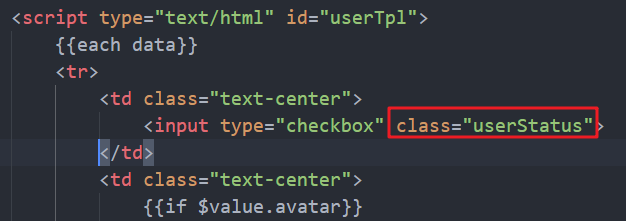
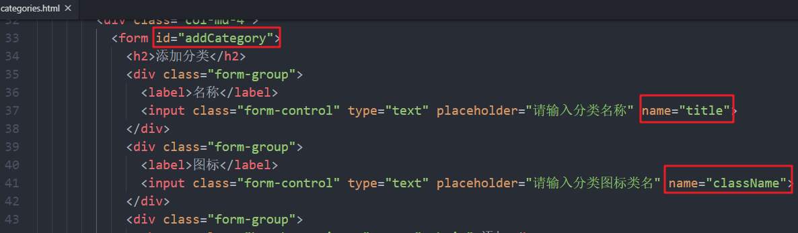
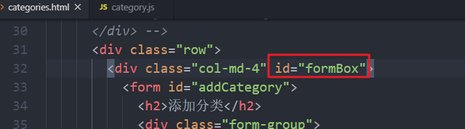

```

```

# 阿里百秀项目

## 目标

- 完成用户管理模块的功能：删除单个用户、批量删除、修改密码
- 完成分类模块的功能：添加分类、展示分类列表、修改分类信息、删除分类
- 完成文章模块的功能：添加文章、上传文章封面图片、文章列表查询、分页查询、筛选查询

## 用户管理功能

### 删除用户功能


##### 核心思路

- 为删除按钮添加点击事件
- 用户确认是否进行删除操作
- 获取到当前被点击的用户的id
- 调用删除用户接口，根据id删除用户，如果删除功能，刷新当前页面，让页面显示最新的内容

##### 核心代码

对应的HTML页面是：`users.html`

对应的JS文件是：`user.js`

- 在user.html里面找到删除按钮(在用户列表模板里面)，添加delete类名，给这个元素绑定用户的id

```html
<a href="javascript:;" class="btn btn-danger btn-xs delete" data-id="{{$value._id}}">删除</a>
```

- 由于删除按钮是动态渲染在页面的，所以通过**事件委托**的形式来注册事件，找到父辈元素来进行绑定

```javascript
$('#userBox').on('click', '.delete', function () {
	...
});
```

- 在事件函数里面，获取到用户点击的这个条目对应的用户id，调用删除的接口

```javascript
$('#userBox').on('click', '.delete', function () {
	// 如果管理员确认要删除用户
	if (confirm('您真的要删除用户吗')) {
		// 获取要删除的用户id
		var id = $(this).attr('data-id');
		// 向服务器端端发送请求 删除用户
		$.ajax({
			type: 'delete',
			url: '/users/'+ id,
			success: function () {
				location.reload()
			}
		})
	}
});
```

### 批量删除用户


#### 核心思路

- 实现用户条目的全选功能
- 当用户点击了全选的checkbox，那么用户的checkbox应该与全选的状态一致
- 当用户点击了用户的checkbox，需要进行判断，是否所有用户进行了勾选，来判断全选是否勾选

  - 获取到所有用户 在所有用户中过滤出选中的用户
  - 判断选中用户的数量和所有用户的数量是否一致
  - 如果一致 就说明所有的用户都是选中的
  - 否则 就是有用户没有被选中
- 当有用户被选中，需要显示批量删除按钮，当没有用户被选中，需要隐藏批量删除按钮
- 给批量删除按钮添加点击事件，把选中的用户的id存入到数组中，然后拼接成接口文档需要的字符串形式


- 调用批量删除的接口，删除成功后，刷新页面

#### 核心代码

##### 【1】全选和全不选

- 找到全选的元素，添加id，找到该元素，添加change事件

  

```javascript
// 获取全选按钮
var selectAll = $('#selectAll');
selectAll.on('change', function () {
...
});
```

- 获取到全选按钮状态，设置每一个用户的复选框

```js
selectAll.on('change', function () {
	// 获取到全选按钮当前的状态
	var status = $(this).prop('checked');
	// 获取到所有的用户并将用户的状态和全选按钮保持一致
	$('#userBox').find('input').prop('checked', status);
});
```

##### 【2】小复选框控制全选

-  注册用户条目的复选框的change事件，当用户每一次点击用户条目的复选框，都需要去校验一次是否全部选中
  - 获取到所有用户 在所有用户中过滤出选中的用户
  - 判断选中用户的数量和所有用户的数量是否一致
  - 如果一致 就说明所有的用户都是选中的
  - 否则 就是有用户没有被选中

在用户列表的模板中，找到小复选框，添加class



-  通过事件委托给小复选框注册change事件

```js
$('#userBox').on('change', '.userStatus', function () {
    // 获取所有的小复选框
	var inputs = $('#userBox').find('input');
    // 判断选中的数量 == 所有的数量
	if (inputs.length == inputs.filter(':checked').length) {
		// alert('所有用户都是选中的')
		selectAll.prop('checked', true)
	}else {
		// alert('不是所有用户都是选中的')
		selectAll.prop('checked', false)
	}
});
```

##### 【3】显示隐藏批量删除按钮

- 找到批量删除按钮（a标签），添加一个id，获取到这个元素，在全选的change事件里面和小复选框的change事件里面，控制其的显示和隐藏

  

```js
// 获取批量删除按钮
var deleteMany = $('#deleteMany');

#更改全选按钮的事件处理函数
// 当全选按钮的状态发生改变时
selectAll.on('change', function () {
	// 获取到全选按钮当前的状态
	var status = $(this).prop('checked');
	if (status) {
		// 显示批量删除按钮
		deleteMany.show();
	}else {
		// 隐藏批量删除按钮
		deleteMany.hide();
	}
    // 获取到所有的用户并将用户的状态和全选按钮保持一致
	$('#userBox').find('input').prop('checked', status);
});

#更改小复选框的chang事件处理函数中的代码
// 当用户前面的复选框状态发生改变时
$('#userBox').on('change', '.userStatus', function () {
	...
	// 如果选中的复选框的数量大于0 就说明有选中的复选框
	if (inputs.filter(':checked').length > 0) {
		// 显示批量删除按钮
		deleteMany.show();
	}else {
		// 隐藏批量删除按钮
		deleteMany.hide();
	}
});
```

##### 【4】完成删除功能

- 给批量删除按钮注册点击事件，在事件函数里面，先获取选中用户的id，存入到数组中

  找到模板中的小复选框，添加data-id属性

  

```javascript
// 为批量删除按钮添加点击事件
deleteMany.on('click', function () {
	var ids = [];
	// 获取选中的用户
	var checkedUser = $('#userBox').find('input').filter(':checked');
	// 循环复选框 从复选框元素的身上获取data-id属性的值
	checkedUser.each(function (index, element) {
		ids.push($(element).attr('data-id'));
	});
    console.log(ids);
});
```

- 调用删除接口，把数组里面的id拼接成需要的字符串形式

```javascript
// 为批量删除按钮添加点击事件
deleteMany.on('click', function () {
	var ids = [];
	// 获取选中的用户
	var checkedUser = $('#userBox').find('input').filter(':checked');
	// 循环复选框 从复选框元素的身上获取data-id属性的值
	checkedUser.each(function (index, element) {
		ids.push($(element).attr('data-id'));
	});
    // console.log(ids);
	if (confirm('您真要确定要进行批量删除操作吗')) {
		$.ajax({
			type: 'delete',
			url: '/users/' + ids.join('-'),
			success: function () {
				location.reload();
			}
		})
	}
});
```

### 修改密码


#### 核心思路

- 为修改密码表单中的每一个表单添加name属性，name属性的值要和接口中的参数名一致
- 为修改密码表单添加表单提交事件，在事件处理函数中，阻止表单的默认提交行为
- 获取到用户在表单中输入的内容
- 调用修改密码接口，实现密码修改功能，如果密码修改成功，跳转到登录页面，让用户重新登录

#### 核心代码

- 找到 `password-reset.html` 页面，给表单元素中添加`name`属性，给form标签添加id


- 在js文件夹中新建一个 `password-reset.js` 文件，并再html文件中引入

  

- 给表单注册submit事件，获取内容，调用接口

```javascript
// 当修改密码表单发生提交行为的时候
$('#modifyForm').on('submit', function () {
	// 获取用户在表单中输入的内容
	var formData = $(this).serialize();
	// 调用接口 实现密码修改功能
	$.ajax({
		url: '/users/password',
		type: 'put',
		data: formData,
		success: function () {
			location.href = "/admin/login.html"
		}
	})
	// 阻止表单默认提交的行为
	return false;
});
```

## 分类功能

### 添加分类


##### 核心思路

- 为表单中每一个表单项添加 name 属性，name 属性的值要和接口文档中要求的参数名称保持一致
- 为表单添加表单提交事件，在事件处理函数中，阻止表单提交的默认行为
- 获取到用户在表单中输入的内容
- 调用分类添加接口，实现添加分类功能

##### 核心代码

对应的HTML页面是：`categories.html`

对应的JS文件是：`category.js`

- 找到 `categories.html`  给每一个表单项添加name属性，form标签添加id



- 在js文件夹中新建category.js文件，并在html文件中引入

  

- 给表单注册submit事件，阻止默认行为，获取用户输入的信息，调用接口，添加成功后，刷新页面

```javascript
// 当添加分类表单发生提交行为的时候
$('#addCategory').on('submit', function () {
	// 获取用户在表单中输入的内容
	var formData = $(this).serialize();
	// 向服务器端发送请求 添加分类
	$.ajax({
		type: 'post',
		url: '/categories',
		data: formData,
		success: function () {
			location.reload();
		}
	})
	// 阻止表单默认提交行为
	return false;
});
```

### 分类列表展示功能


##### 核心思路

- 向服务器端发送Ajax请求，获取分类页面数据
- 使用模板引擎将服务器端返回的数据和HTML模板进行拼接
- 将拼接好的内容展示在页面

##### 核心代码

- 引入模板引擎库文件

  

- 创建模板，找到静态页面结构，`copy`一份`tr`，对相应的位置进行修改，获取的是多个，我们需要遍历

```html
  <!-- 分类列表模板 -->
  <script type="text/html" id="categoryListTpl">
    {{each data}}
    <tr>
      <td class="text-center"><input type="checkbox"></td>
      <td>{{$value.title}}</td>
      <td class="text-center">
        <a href="javascript:;" class="btn btn-info btn-xs edit" data-id="{{$value._id}}">编辑</a>
        <a href="javascript:;" class="btn btn-danger btn-xs delete" data-id="{{$value._id}}">删除</a>
      </td>
    </tr>
    {{/each}}
  </script>
```

- 给tbody标签添加id

  

- 利用`ajax`请求，渲染数据

```javascript
// 发送ajax请求 向服务器端所有分类列表数据
$.ajax({
	type: 'get',
	url: '/categories',
	success: function (response) {
		// 将服务器端返回的数据和HTML模板进行拼接
		var html = template('categoryListTpl', {data: response});
		// 将拼接好的内容放到页面中
		$('#categoryBox').html(html);
	}
});
```

### 分类修改功能


##### 核心思路

- 通过事件委托为编辑按钮添加点击事件，在事件处理函数中获取到要修改的分类数据id
  - 利用自定义属性，把对应的分类id设置到自定义属性中
- 根据id调用接口，获取分类数据的详细信息
- 利用模板引擎讲分类数据和HTML字符进行拼接，拼接完成后将内容渲染到页面中
- 为修改按钮添加点击事件，在事件处理函数中获取到管理员在表中输入的内容
- 调用修改分类数据接口，实现分类数据修改功能

##### 核心代码

- 在模板代码，找到【编辑按钮】，添加class和data-id属性

  

- 通过事件委托绑定事件，获取分类的id，调用接口，传入分类的id，获取分类的详细信息

```javascript
$('#categoryBox').on('click', '.edit', function () {
	// 获取要修改的分类数据的id
	var id = $(this).attr('data-id');
	// 根据id获取分类数据的详细信息
	$.ajax({
		type: 'get',
		url: '/categories/' + id,
		success: function (response) {
			console.log(response);
		}
	})
});
```

- 创建模板引擎，这个模板就是添加数据的表单结构，修改一下里面内容，给表单添加一个自定属性

```html
 <!-- 分类数据修改模板 -->
  <script type="text/html" id="modifyCategoryTpl">
    <form id="modifyCategory" data-id="{{_id}}">
      <h2>修改分类</h2>
      <div class="form-group">
        <label>名称</label>
        <input class="form-control" type="text" placeholder="请输入分类名称" name="title" value="{{title}}">
      </div>
      <div class="form-group">
        <label>图标</label>
        <input class="form-control" type="text" placeholder="请输入分类图标类名" name="className" value="{{className}}">
      </div>
      <div class="form-group">
        <button class="btn btn-primary" type="submit">修改</button>
      </div>
    </form>
  </script>
```

- 修改js代码，渲染修改表单到页面

  给form标签的父元素添加id

  

  ```javascript
  $('#categoryBox').on('click', '.edit', function () {
  	// 获取要修改的分类数据的id
  	var id = $(this).attr('data-id');
  	// 根据id获取分类数据的详细信息
  	$.ajax({
  		type: 'get',
  		url: '/categories/' + id,
  		success: function (response) {
  			// console.log(response)
  			var html = template('modifyCategoryTpl', response);
  			$('#formBox').html(html);
  		}
  	})
  });
  ```

- 给修改分类的表单，注册提交事件

```javascript
$('#formBox').on('submit', '#modifyCategory', function () {
	// 获取管理员在表单中输入的内容
	var formData = $(this).serialize();
	// 获取要修改的分类id
	var id = $(this).attr('data-id');
	// 发送请求 修改分类数据
	$.ajax({
		type: 'put',
		url: '/categories/' + id,
		data: formData,
		success: function () {
			location.reload();
		}
	})
	// 阻止表单的默认提交行为
	return false;
});
```

### 分类删除功能


##### 核心思路

- 通过事件委托的方式为删除按钮添加点击事件，在点击事件处理函数弹出删除确认框
- 在用户点击了确认删除后，获取要删除的分类数据的id
- 调用删除分类数据接口，实现删除分类数据功能，如果分类删除成功，刷新页面

##### 核心代码

- 在模板中给删除按钮添加一个data-id自定义属性，把分类的id设置进去，并添加class

```html
<a href="javascript:;" class="btn btn-danger btn-xs delete" data-id="{{$value._id}}">删除</a>
```

- 通过事件委托，给删除按钮注册点击事件

```javascript
// 当删除按钮被点击的时候
$('#categoryBox').on('click', '.delete', function () {
	if (confirm('您真的要执行删除操作吗')) {
		// 获取要删除的分类数据id
		var id = $(this).attr('data-id');
		// 向服务器端发送请求 删除分类数据
		$.ajax({
			type: 'delete',
			url: '/categories/' + id,
			success: function () {
				location.reload();
			}
		})
	}
});
```

## 文章功能

### 添加文章


添加一篇文章需要选择相应的分类，所以在管理员进行添加之前，这些分类列表应该从服务器去进行获取，然后供管理员来使用

#### 核心思路

- 获取文章分类数据，并将数据显示在所属分类的下拉列表中，供管理员选择
- 实现文章封面图片上传，并将上传后的图片地址保存在一个隐藏域中
- 为添加文章表单中的每一个表单项添加name属性，并且name属性值要和接口中要求的参数名称一致
- 为添加文章列表绑定表单提交事件，在事件处理函数中阻止表单默认提交的行为
- 获取到管理员在表单中输入的内容
- 向服务器端发送添加文章的请求，实现文章添加功能，文章添加成功以后要跳转到文章列表页面

#### 核心代码

对应的HTML页面是：`post-add.html`

对应的JS文件是：`post-add.js`

在js文件夹新建一个post-add.js文件，在html文件中引入。


##### 【1】获取分类，渲染到分类列表


- 获取文章分类的数据

```javascript
$.ajax({
	url: '/categories',
	type: 'get',
	success: function (response) {
        //拼接模板，显示在页面
		var html = template('categoryTpl', {data: response});
		$('#category').html(html);
	}
})
```

- 引入模板引擎的库文件

  

- 创建模板，利用模板引擎将数据跟HTML进行拼接，拼接的时候需要把分类的id绑定在相应的option中

  

```js
  <!-- 文章所属分类下拉列表 -->  
<script type="text/html" id="categoryTpl">
     {{each data}}
     <option value="{{$value._id}}">{{$value.title}}</option>
     {{/each}}
  </script>
```

##### 【2】文章封面图片上传

- 封面图片上传的功能，然后把图片的路径放在隐藏域中

  

```js
#给文件上传控件，注册change事件
$('#feature').on('change', function () {
	// 获取到管理员选择到的文件 不管用户上传多少个文件，这个文件的信息都存储在files中
	var file = this.files[0];
	// 创建formData对象 实现二进制文件上传
	var formData = new FormData();
	// 将选择到的文件追加到formData对象中
	formData.append('cover', file);
	// 实现文章封面图片上传
	$.ajax({
		type: 'post',
		url: '/upload',
		data: formData,
		// 告诉$.ajax方法不要处理data属性对应的参数
		processData: false,
		// 告诉$.ajax方法不要设置参数类型
		contentType: false,
		success: function (response) {
            // 把图片的保存路径保存到隐藏域中
			$('#thumbnail').val(response[0].cover);
		}
	})
});
```

##### 【3】完成添加功能

- 在 post-add.html 页面中，给相应的表单元素添加name属性，注意：name属性的值要和接口文档中参数名一致

  

- 给form标签添加id

  

- 给表单绑定submit事件，取消默认行为，在里面获取表单里面的内容，调用接口，传递到服务器

```javascript
$('#addForm').on('submit', function () {
	// 获取管理员在表单中输入的内容
	var formData = $(this).serialize();
	// 向服务器端发送请求 实现添加文章功能
	$.ajax({
		type: 'post',
		url: '/posts',
		data: formData,
		success: function () {
			// 文章添加成功 跳转到文章列表页面
			location.href = '/admin/posts.html'
		}
	})
	// 阻止表单默认提交的行为
	return false;
});
```

### 文章列表数据展示


#### 核心思路

- 在页面一加载的时候向服务器端发送请求索要文章列表数据
- 通过模板引擎将文字列表数据和HTML进行拼接，拼接完成以后将内容显示在页面
- 根据分页数据实现列表数据分页功能

#### 核心代码

对应的HTML页面是：`posts.html`

对应的JS文件是：`posts.js`

在js文件夹中新建posts.js文件，并在html文件中引入


##### 【1】渲染列表数据

- 利用ajax请求，获取文章列表数据

```javascript
// 向服务器端发送请求 获取文章列表数据
$.ajax({
	type: 'get',
	url: '/posts',
	success: function (response) {
        console.log(response);
	}
});
```

- 引入模板引擎库文件

  

- 创建模板，找到静态页面中的tr即可，复制过来修改一下

```
   <!-- 文章列表数据模板 -->
  <script type="text/html" id="postsTpl">
    {{each records}}
    <tr>
      <td>{{$value.title}}</td>
      <td>{{$value.author.nickName}}</td>
      <td>{{$value.category.title}}</td>
      <td class="text-center">{{$value.createAt}}</td>
      <td class="text-center">{{$value.state == 1 ? '已发布' : '未发布'}}</td>
      <td class="text-center">
        <a href="javascript:;" class="btn btn-default btn-xs">编辑</a>
        <a href="javascript:;" class="btn btn-danger btn-xs">删除</a>
      </td>
    </tr>
    {{/each}}
  </script>
```

- 给tbody标签添加id

  

  

- 修改js代码，渲染文章数据

```javascript
$.ajax({
	type: 'get',
	url: '/posts',
	success: function (response) {
        // console.log(response);
		var html = template('postsTpl', response);
		$('#postsBox').html(html);
	}
});
```

##### 【2】处理列表中的日期

post.js

```js
// 处理日期时间格式
function formateDate(date) {
	// 将日期时间字符串转换成日期对象
	date = new Date(date);
	return date.getFullYear() + '-' + (date.getMonth() + 1) + '-' + date.getDate()
}
```

模板中

```
  <td class="text-center">{{$imports.formateDate($value.createAt)}}</td>
```

##### 【3】分页功能

返回的文章列表数据中包含了【分页信息】

- 分页功能实现，找到静态页面中分页的结构，把**页码信息展示在页面**中
  
  - 展示文章列表时，把分页信息展示在页面
  
    ```js
    #response返回值中含有页面信息
    // 向服务器端发送请求 获取文章列表数据
    $.ajax({
    	type: 'get',
    	url: '/posts',
    	success: function (response) {
            console.log(response);
            // 展示文章信息
    		var html = template('postsTpl', response);
    		$('#postsBox').html(html);
            // 展示分页信息
    		var page = template('pageTpl', response);
    		$('#page').html(page);
    	}
    });
    ```
  
  - 给ul标签添加id
  
    
  
  - 创建模板，在服务器返回的数据里面，page就代表的是当前页，所以我们可以在上一页和下一页利用page进行处理

```html
 <!-- 分页模板 -->
  <script type="text/html" id="pageTpl">
    {{if page > 1}}
    	<li><a href="javascript:;" onclick="changePage({{page-1}})">上一页</a></li>
    {{/if}}
    {{each display}}
    	<li><a href="javascript:;" onclick="changePage({{$value}})">{{$value}}</a></li>
    {{/each}}
    {{if page < pages}}
    	<li><a href="javascript:;" onclick="changePage({{page+1}})">下一页</a></li>
    {{/if}}
  </script>
```

- 在`js`中对`changePage`函数进行处理，当**点击了分页**的导航栏就会触发这个函数，把当前要显示的页数传递了过来，我们只需要再次请求服务器即可

```javascript
function changePage(page) {
    // 向服务器端发送请求 获取文章列表数据
    $.ajax({
        type: 'get',
        url: '/posts',
        data: {
            page: page
        },
        success: function(response) {
            var html = template('postsTpl', response);
            $('#postsBox').html(html);
            var page = template('pageTpl', response);
            $('#page').html(page);
        }
    });
}
```

### 文章筛选

#### 核心思路

- 向服务器端发送请求，**获取分类数据**，并将数据显示在所属分类的下拉列表中
- 为筛选按钮添加点击事件，在事件处理函数中获取用户选择到的内容
- 向服务器端发送请求，获取管理员要求的文章列表数据，并将数据显示在页面

#### 核心代码

##### 【1】渲染分类数据

- 向服务器发送请求，获取分类列表的数据

```javascript
// 向服务器端发送请求 索要分类数据
$.ajax({
    type: 'get',
    url: '/categories',
    success: function(response) {
        console.log(response)
        var html = template('categoryTpl', { data: response });
        $('#categoryBox').html(html);
    }
})
```

- 给select标签添加id

  

- 创建分类的模板

 <!-- 分类列表下拉框模板 -->
```html
  <script type="text/html" id="categoryTpl">
    {{each data}}
    <option value="{{$value._id}}">{{$value.title}}</option>
    {{/each}}
  </script>
```

##### 【2】筛选功能

- 给文章状态添加value值，

```html
<option value="0">草稿</option>
<option value="1">已发布</option>
```

- 给两个表单项添加name值


- 给form标签添加id

  

- 给筛选表单注册submit事件，单击筛选按钮，获取分类的id以及文章状态，发送请求传递到服务器，重新渲染文章和分页数据

```javascript
$('#filterForm').on('submit', function() {
    // 获取到管理员选择的过滤条件
    var formData = $(this).serialize();
    // 向服务器端发送请求 根据条件索要文章列表数据
    $.ajax({
        type: 'get',
        url: '/posts',
        data: formData,
        success: function(response) {
            // 重新渲染文章和分页数据
            var html = template('postsTpl', response);
            $('#postsBox').html(html);
            var page = template('pageTpl', response);
            $('#page').html(page);
        }
    });
    // 阻止表单默认提交行为
    return false;
});
```

